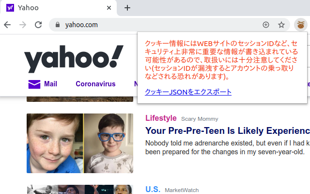
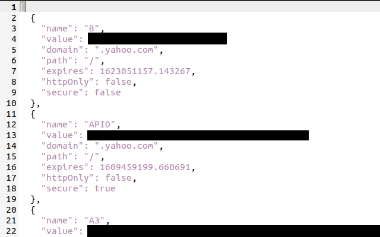

#  クッキーJSONファイル出力 for Puppeteer

[Puppeteer](https://pptr.dev/)や[cheerio-httpcli](https://github.com/ktty1220/cheerio-httpcli)でインポート可能なクッキーJSONファイルを出力するブラウザ拡張機能です。

## インストール

* [Google Chrome](https://chrome.google.com/webstore/detail/nmckokihipjgplolmcmjakknndddifde)
* [Firefox](https://addons.mozilla.org/ja/firefox/addon/%E3%82%AF%E3%83%83%E3%82%AD%E3%83%BCjson%E3%83%95%E3%82%A1%E3%82%A4%E3%83%AB%E5%87%BA%E5%8A%9B-for-puppeteer/)

## 使用方法

拡張機能のアイコンをクリックすると、現在開いているページで保存されているクッキー情報をJSONファイルとして保存できます。




保存したJSONファイルは以下のように使用できます。

### Puppeteer

```js
const puppeteer = require('puppeteer');
  .
  .
  .
const browser = await puppeteer.launch({ headless: true });
const page = await browser.newPage();
const cookies = JSON.parse(fs.readFileSync(<エクスポートしたクッキーJSONファイル>, 'utf-8'));
for (const cookie of cookies) {
  await page.setCookie(cookie);
}
await page.goto(...);
```

### cheerio-httpcli

```js
const client = require('cheerio-httpcli');
  .
  .
  .
const cookies = JSON.parse(fs.readFileSync(<エクスポートしたクッキーJSONファイル>, 'utf-8'));
client.importCookies(cookies);
client.fetch(...);
```

## ライセンス

[MIT license](http://www.opensource.org/licenses/mit-license)で配布します。

&copy; 2020 [ktty1220](mailto:ktty1220@gmail.com)
